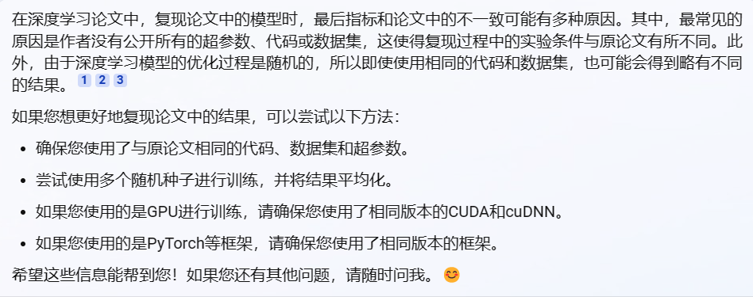

# rjl代码搜索

## 关于unixcoder（预训练生成embedding）
对于代码搜索，unixcoder是用于：
- 计算code和NL的embeddings
- 计算二者的相似度
- 排序，输出搜索结果

## 关于code-search和run.py
以AdvTest数据集为例:
- Zero-shot是直接用AdvTest的测试集，评估预训练模型的MRR
- 微调则是用AdvTest的训练集和验证集进行微调，然后用测试集评估MRR

也就是说，这个run.py是用来得出论文中实验结果的，开销大，不要在自己电脑上随便尝试

## 但是可以用run.py的逻辑功能，完成智慧编程的代码搜索功能部署
具体做法:（难度较大，要读懂后端代码，前端也要适配好）
- 前端提供自然语言查询的输入
- 该查询传给这个项目生成embedding
- 查询和本地代码库/数据集中的embedding计算相似度并排序
- 返回前端，用表格之类的形式展示给用户


# CodeSearch微调

## CSN数据集微调，Python，2023/4/22

- 训练：
```bash
# Training
lang=python
python run.py \
    --output_dir saved_models/CSN/$lang \
    --model_name_or_path microsoft/unixcoder-base  \
    --do_train \
    --train_data_file dataset/CSN/$lang/train.jsonl \
    --eval_data_file dataset/CSN/$lang/valid.jsonl \
    --codebase_file dataset/CSN/$lang/codebase.jsonl \
    --num_train_epochs 10 \
    --code_length 256 \
    --nl_length 128 \
    --train_batch_size 64 \
    --eval_batch_size 64 \
    --learning_rate 2e-5 \
    --seed 123456 
```

- 控制台打印结果：（微调了近8.5小时）

```bash
(rjl_py39) b418@b418:~/disk4.0T/rjl/unixcoder/downstream-tasks/code-search$ python run.py \
>     --output_dir saved_models/CSN/$lang \
>     --model_name_or_path microsoft/unixcoder-base  \
>     --do_train \
>     --train_data_file dataset/CSN/$lang/train.jsonl \
>     --eval_data_file dataset/CSN/$lang/valid.jsonl \
>     --codebase_file dataset/CSN/$lang/codebase.jsonl \
>     --num_train_epochs 10 \
>     --code_length 256 \
>     --nl_length 128 \
>     --train_batch_size 64 \
>     --eval_batch_size 64 \
>     --learning_rate 2e-5 \
>     --seed 123456 
04/22/2023 11:56:29 - INFO - __main__ -   device: cuda, n_gpu: 2
04/22/2023 11:56:31 - INFO - __main__ -   Training/evaluation parameters Namespace(train_data_file='dataset/CSN/python/train.jsonl', output_dir='saved_models/CSN/python', eval_data_file='dataset/CSN/python/valid.jsonl', test_data_file=None, codebase_file='dataset/CSN/python/codebase.jsonl', model_name_or_path='microsoft/unixcoder-base', config_name='', tokenizer_name='', nl_length=128, code_length=256, do_train=True, do_eval=False, do_test=False, do_zero_shot=False, do_F2_norm=False, train_batch_size=64, eval_batch_size=64, learning_rate=2e-05, max_grad_norm=1.0, num_train_epochs=10, seed=123456, n_gpu=2, device=device(type='cuda'))
04/22/2023 11:58:03 - INFO - __main__ -   *** Example ***
04/22/2023 11:58:03 - INFO - __main__ -   idx: 0
04/22/2023 11:58:03 - INFO - __main__ -   code_tokens: ['<s>', '<encoder-only>', '</s>', 'def', '_split', '_', 'phy', 'log', 'en', 'y', '_(', '_p', '_,', '_level', '_=', '_"', 's', '"', '_)', '_:', '_level', '_=', '_level', '_+', '_"__', '"', '_result', '_=', '_p', '_.', '_split', '_(', '_level', '_)', '_return', '_result', '_[', '_0', '_]', '_+', '_level', '_+', '_result', '_[', '_1', '_]', '_.', '_split', '_(', '_";"', '_)', '_[', '_0', '_]', '</s>']
04/22/2023 11:58:03 - INFO - __main__ -   code_ids: 0 6 2 729 5192 181 3258 896 386 207 400 428 2019 3144 385 437 201 120 743 545 3144 385 3144 513 12945 120 1046 385 428 746 5192 400 3144 743 483 1046 626 461 2406 513 3144 513 1046 626 524 2406 746 5192 400 29760 743 626 461 2406 2 1 1 1 1 1 1 1 1 1 1 1 1 1 1 1 1 1 1 1 1 1 1 1 1 1 1 1 1 1 1 1 1 1 1 1 1 1 1 1 1 1 1 1 1 1 1 1 1 1 1 1 1 1 1 1 1 1 1 1 1 1 1 1 1 1 1 1 1 1 1 1 1 1 1 1 1 1 1 1 1 1 1 1 1 1 1 1 1 1 1 1 1 1 1 1 1 1 1 1 1 1 1 1 1 1 1 1 1 1 1 1 1 1 1 1 1 1 1 1 1 1 1 1 1 1 1 1 1 1 1 1 1 1 1 1 1 1 1 1 1 1 1 1 1 1 1 1 1 1 1 1 1 1 1 1 1 1 1 1 1 1 1 1 1 1 1 1 1 1 1 1 1 1 1 1 1 1 1 1 1 1 1 1 1 1 1 1 1 1 1 1 1 1 1 1 1 1 1 1 1 1
04/22/2023 11:58:03 - INFO - __main__ -   nl_tokens: ['<s>', '<encoder-only>', '</s>', 'Return', '_either', '_the', '_full', '_or', '_truncated', '_version', '_of', '_a', '_Q', 'II', 'ME', '_-', '_formatted', '_taxonomy', '_string', '_.', '</s>']
04/22/2023 11:58:03 - INFO - __main__ -   nl_ids: 0 6 2 1675 4759 448 3662 872 19307 2229 595 434 1152 4300 1098 581 10440 29021 724 746 2 1 1 1 1 1 1 1 1 1 1 1 1 1 1 1 1 1 1 1 1 1 1 1 1 1 1 1 1 1 1 1 1 1 1 1 1 1 1 1 1 1 1 1 1 1 1 1 1 1 1 1 1 1 1 1 1 1 1 1 1 1 1 1 1 1 1 1 1 1 1 1 1 1 1 1 1 1 1 1 1 1 1 1 1 1 1 1 1 1 1 1 1 1 1 1 1 1 1 1 1 1 1 1 1 1 1 1
04/22/2023 11:58:03 - INFO - __main__ -   *** Example ***
04/22/2023 11:58:03 - INFO - __main__ -   idx: 1
04/22/2023 11:58:03 - INFO - __main__ -   code_tokens: ['<s>', '<encoder-only>', '</s>', 'def', '_ensure', '_', 'dir', '_(', '_d', '_)', '_:', '_if', '_not', '_os', '_.', '_path', '_.', '_exists', '_(', '_d', '_)', '_:', '_try', '_:', '_os', '_.', '_m', 'akedirs', '_(', '_d', '_)', '_except', '_OSError', '_as', '_oe', '_:', '_#', '_should', '_not', '_happen', '_with', '_os', '.', 'makedirs', '_#', '_ENOENT', ':', '_No', '_such', '_file', '_or', '_directory', '_if', '_os', '_.', '_errno', '_==', '_errno', '_.', '_ENOENT', '_:', '_msg', '_=', '_tw', 'dd', '_(', '_"""', 'One', '_or', '_more', '_directories', '_in', '_the', '_path', '_({})', '_do', '_not', '_exist', '.', '_If', 'Ċ', '__________________________', '_you', '_are', '_specifying', '_a', '_new', '_directory', '_for', '_output', ',', '_please', '_ensure', 'Ċ', '__________________________', '_all', '_other', '_directories', '_in', '_the', '_path', '_currently', '_exist', '."""', '_)', '_return', '_msg', '_.', '_format', '_(', '_d', '_)', '_else', '_:', '_msg', '_=', '_tw', 'dd', '_(', '_"""', 'An', '_error', '_occurred', '_trying', '_to', '_create', '_the', '_output', '_directory', 'Ċ', '__________________________', '_({})', '_with', '_message', ':', '_{}', '"""', '_)', '_return', '_msg', '_.', '_format', '_(', '_d', '_,', '_oe', '_.', '_strerror', '_)', '</s>']
04/22/2023 11:58:03 - INFO - __main__ -   code_ids: 0 6 2 729 6229 181 1282 400 480 743 545 462 800 2215 746 1391 746 4534 400 480 743 545 1568 545 2215 746 446 23328 400 480 743 3552 22934 880 44902 545 830 1570 800 7564 918 2215 132 24429 830 41059 144 4038 5632 1012 872 3456 462 2215 746 2341 550 2341 746 41059 545 2345 385 7916 443 400 1638 3533 872 2726 11613 488 448 1391 46072 1000 800 3040 132 1359 317 4584 2713 1147 15323 434 579 3456 563 1721 130 13874 6229 317 4584 1345 1946 11613 488 448 1391 6418 3040 6315 743 483 2345 746 2021 400 480 743 669 545 2345 385 7916 443 400 1638 1088 843 10058 11749 508 1738 448 1721 3456 317 4584 46072 918 1841 144 2334 3947 743 483 2345 746 2021 400 480 2019 44902 746 20115 743 2 1 1 1 1 1 1 1 1 1 1 1 1 1 1 1 1 1 1 1 1 1 1 1 1 1 1 1 1 1 1 1 1 1 1 1 1 1 1 1 1 1 1 1 1 1 1 1 1 1 1 1 1 1 1 1 1 1 1 1 1 1 1 1 1 1 1 1 1 1 1 1 1 1 1 1 1 1 1 1 1 1 1 1 1 1 1 1 1 1 1 1 1 1 1 1 1 1 1 1 1 1 1 1 1 1 1
04/22/2023 11:58:03 - INFO - __main__ -   nl_tokens: ['<s>', '<encoder-only>', '</s>', 'Check', '_to', '_make', '_sure', '_the', '_supplied', '_directory', '_path', '_does', '_not', '_exist', '_if', '_so', '_create', '_it', '_.', '_The', '_method', '_catch', 'es', '_OSError', '_exceptions', '_and', '_returns', '_a', '_desc', 'riptive', '_message', '_instead', '_of', '_re', '_-', '_raising', '_the', '_error', '_.', '</s>']
04/22/2023 11:58:03 - INFO - __main__ -   nl_ids: 0 6 2 1749 508 2002 3984 448 8813 3456 1391 2129 800 3040 462 1769 1738 835 746 1044 1454 2092 482 22934 12300 706 2060 434 2162 44105 1841 4488 595 479 581 47183 448 843 746 2 1 1 1 1 1 1 1 1 1 1 1 1 1 1 1 1 1 1 1 1 1 1 1 1 1 1 1 1 1 1 1 1 1 1 1 1 1 1 1 1 1 1 1 1 1 1 1 1 1 1 1 1 1 1 1 1 1 1 1 1 1 1 1 1 1 1 1 1 1 1 1 1 1 1 1 1 1 1 1 1 1 1 1 1 1 1 1 1
04/22/2023 11:58:03 - INFO - __main__ -   *** Example ***
04/22/2023 11:58:03 - INFO - __main__ -   idx: 2
04/22/2023 11:58:03 - INFO - __main__ -   code_tokens: ['<s>', '<encoder-only>', '</s>', 'def', '_file', '_', 'handle', '_(', '_fn', 'h', '_,', '_mode', '_=', '_"', 'r', 'U', '"', '_)', '_:', '_handle', '_=', '_None', '_if', '_isinstance', '_(', '_fn', 'h', '_,', '_file', '_)', '_:', '_if', '_fn', 'h', '_.', '_closed', '_:', '_raise', '_ValueError', '_(', '_"', 'Input', '_file', '_is', '_closed', '."', '_)', '_handle', '_=', '_fn', 'h', '_elif', '_isinstance', '_(', '_fn', 'h', '_,', '_str', '_)', '_:', '_handle', '_=', '_open', '_(', '_fn', 'h', '_,', '_mode', '_)', '_return', '_handle', '</s>']
04/22/2023 11:58:03 - INFO - __main__ -   code_ids: 0 6 2 729 1012 181 2133 400 4065 190 2019 2119 385 437 200 171 120 743 545 2384 385 1938 462 5408 400 4065 190 2019 1012 743 545 462 4065 190 746 8264 545 3085 6052 400 437 1834 1012 555 8264 3508 743 2384 385 4065 190 3625 5408 400 4065 190 2019 1113 743 545 2384 385 2717 400 4065 190 2019 2119 743 483 2384 2 1 1 1 1 1 1 1 1 1 1 1 1 1 1 1 1 1 1 1 1 1 1 1 1 1 1 1 1 1 1 1 1 1 1 1 1 1 1 1 1 1 1 1 1 1 1 1 1 1 1 1 1 1 1 1 1 1 1 1 1 1 1 1 1 1 1 1 1 1 1 1 1 1 1 1 1 1 1 1 1 1 1 1 1 1 1 1 1 1 1 1 1 1 1 1 1 1 1 1 1 1 1 1 1 1 1 1 1 1 1 1 1 1 1 1 1 1 1 1 1 1 1 1 1 1 1 1 1 1 1 1 1 1 1 1 1 1 1 1 1 1 1 1 1 1 1 1 1 1 1 1 1 1 1 1 1 1 1 1 1 1 1 1 1 1 1 1 1 1 1 1 1 1 1 1 1 1 1 1 1 1 1 1 1
04/22/2023 11:58:03 - INFO - __main__ -   nl_tokens: ['<s>', '<encoder-only>', '</s>', 'Takes', '_either', '_a', '_file', '_path', '_or', '_an', '_open', '_file', '_handle', '_checks', '_validity', '_and', '_returns', '_an', '_open', '_file', '_handle', '_or', '_raises', '_an', '_appropriate', '_Exception', '_.', '</s>']
04/22/2023 11:58:03 - INFO - __main__ -   nl_ids: 0 6 2 27408 4759 434 1012 1391 872 817 2717 1012 2384 7825 25911 706 2060 817 2717 1012 2384 872 23154 817 7900 2654 746 2 1 1 1 1 1 1 1 1 1 1 1 1 1 1 1 1 1 1 1 1 1 1 1 1 1 1 1 1 1 1 1 1 1 1 1 1 1 1 1 1 1 1 1 1 1 1 1 1 1 1 1 1 1 1 1 1 1 1 1 1 1 1 1 1 1 1 1 1 1 1 1 1 1 1 1 1 1 1 1 1 1 1 1 1 1 1 1 1 1 1 1 1 1 1 1 1 1 1 1 1
/home/b418/anaconda3/envs/rjl_py39/lib/python3.9/site-packages/transformers/optimization.py:391: FutureWarning: This implementation of AdamW is deprecated and will be removed in a future version. Use the PyTorch implementation torch.optim.AdamW instead, or set `no_deprecation_warning=True` to disable this warning
  warnings.warn(
04/22/2023 11:58:04 - INFO - __main__ -   ***** Running training *****
04/22/2023 11:58:04 - INFO - __main__ -     Num examples = 251820
04/22/2023 11:58:04 - INFO - __main__ -     Num Epochs = 10
04/22/2023 11:58:04 - INFO - __main__ -     Instantaneous batch size per GPU = 32
04/22/2023 11:58:04 - INFO - __main__ -     Total train batch size  = 64
04/22/2023 11:58:04 - INFO - __main__ -     Total optimization steps = 39350
04/22/2023 11:59:16 - INFO - __main__ -   epoch 0 step 100 loss 0.14994
04/22/2023 12:00:27 - INFO - __main__ -   epoch 0 step 200 loss 0.10662
04/22/2023 12:01:38 - INFO - __main__ -   epoch 0 step 300 loss 0.10338
04/22/2023 12:02:50 - INFO - __main__ -   epoch 0 step 400 loss 0.09989
04/22/2023 12:04:01 - INFO - __main__ -   epoch 0 step 500 loss 0.09294
04/22/2023 12:05:12 - INFO - __main__ -   epoch 0 step 600 loss 0.08814
04/22/2023 12:06:24 - INFO - __main__ -   epoch 0 step 700 loss 0.09068
04/22/2023 12:07:35 - INFO - __main__ -   epoch 0 step 800 loss 0.08893
04/22/2023 12:08:46 - INFO - __main__ -   epoch 0 step 900 loss 0.09021
04/22/2023 12:09:58 - INFO - __main__ -   epoch 0 step 1000 loss 0.09466
04/22/2023 12:11:09 - INFO - __main__ -   epoch 0 step 1100 loss 0.09324
04/22/2023 12:12:21 - INFO - __main__ -   epoch 0 step 1200 loss 0.08672
04/22/2023 12:13:33 - INFO - __main__ -   epoch 0 step 1300 loss 0.08099
04/22/2023 12:14:44 - INFO - __main__ -   epoch 0 step 1400 loss 0.08855
04/22/2023 12:15:56 - INFO - __main__ -   epoch 0 step 1500 loss 0.0798
04/22/2023 12:17:08 - INFO - __main__ -   epoch 0 step 1600 loss 0.07989
04/22/2023 12:18:19 - INFO - __main__ -   epoch 0 step 1700 loss 0.07876
04/22/2023 12:19:31 - INFO - __main__ -   epoch 0 step 1800 loss 0.06907
04/22/2023 12:20:43 - INFO - __main__ -   epoch 0 step 1900 loss 0.07197
04/22/2023 12:21:54 - INFO - __main__ -   epoch 0 step 2000 loss 0.0763
04/22/2023 12:23:06 - INFO - __main__ -   epoch 0 step 2100 loss 0.07163
04/22/2023 12:24:18 - INFO - __main__ -   epoch 0 step 2200 loss 0.07352
04/22/2023 12:25:29 - INFO - __main__ -   epoch 0 step 2300 loss 0.07629
04/22/2023 12:26:42 - INFO - __main__ -   epoch 0 step 2400 loss 0.0808
04/22/2023 12:27:53 - INFO - __main__ -   epoch 0 step 2500 loss 0.06476
04/22/2023 12:29:05 - INFO - __main__ -   epoch 0 step 2600 loss 0.07127
04/22/2023 12:30:17 - INFO - __main__ -   epoch 0 step 2700 loss 0.08199
04/22/2023 12:31:28 - INFO - __main__ -   epoch 0 step 2800 loss 0.07446
04/22/2023 12:32:40 - INFO - __main__ -   epoch 0 step 2900 loss 0.07467
04/22/2023 12:33:52 - INFO - __main__ -   epoch 0 step 3000 loss 0.07508
04/22/2023 12:35:04 - INFO - __main__ -   epoch 0 step 3100 loss 0.07772
04/22/2023 12:36:16 - INFO - __main__ -   epoch 0 step 3200 loss 0.07196
04/22/2023 12:37:28 - INFO - __main__ -   epoch 0 step 3300 loss 0.07039
04/22/2023 12:38:39 - INFO - __main__ -   epoch 0 step 3400 loss 0.07493
04/22/2023 12:39:52 - INFO - __main__ -   epoch 0 step 3500 loss 0.07056
04/22/2023 12:41:03 - INFO - __main__ -   epoch 0 step 3600 loss 0.0704
04/22/2023 12:42:15 - INFO - __main__ -   epoch 0 step 3700 loss 0.07892
04/22/2023 12:43:27 - INFO - __main__ -   epoch 0 step 3800 loss 0.07584
04/22/2023 12:44:39 - INFO - __main__ -   epoch 0 step 3900 loss 0.0663
04/22/2023 12:45:22 - INFO - __main__ -   ***** Running evaluation *****
04/22/2023 12:45:22 - INFO - __main__ -     Num queries = 13914
04/22/2023 12:45:22 - INFO - __main__ -     Num codes = 43827
04/22/2023 12:45:22 - INFO - __main__ -     Batch size = 64
04/22/2023 12:48:22 - INFO - __main__ -     eval_mrr = 0.6996
04/22/2023 12:48:22 - INFO - __main__ -     ********************
04/22/2023 12:48:22 - INFO - __main__ -     Best mrr:0.6996
04/22/2023 12:48:22 - INFO - __main__ -     ********************
04/22/2023 12:48:32 - INFO - __main__ -   Saving model checkpoint to saved_models/CSN/python/checkpoint-best-mrr/model.bin
04/22/2023 12:49:43 - INFO - __main__ -   epoch 1 step 100 loss 0.05254
04/22/2023 12:50:54 - INFO - __main__ -   epoch 1 step 200 loss 0.04079
04/22/2023 12:52:06 - INFO - __main__ -   epoch 1 step 300 loss 0.03313
04/22/2023 12:53:18 - INFO - __main__ -   epoch 1 step 400 loss 0.03147
04/22/2023 12:54:29 - INFO - __main__ -   epoch 1 step 500 loss 0.04026
04/22/2023 12:55:41 - INFO - __main__ -   epoch 1 step 600 loss 0.04148
04/22/2023 12:56:53 - INFO - __main__ -   epoch 1 step 700 loss 0.03889
04/22/2023 12:58:05 - INFO - __main__ -   epoch 1 step 800 loss 0.04019
04/22/2023 12:59:17 - INFO - __main__ -   epoch 1 step 900 loss 0.04306
04/22/2023 13:00:29 - INFO - __main__ -   epoch 1 step 1000 loss 0.03836
04/22/2023 13:01:41 - INFO - __main__ -   epoch 1 step 1100 loss 0.0411
04/22/2023 13:02:53 - INFO - __main__ -   epoch 1 step 1200 loss 0.03649
04/22/2023 13:04:04 - INFO - __main__ -   epoch 1 step 1300 loss 0.04274
04/22/2023 13:05:17 - INFO - __main__ -   epoch 1 step 1400 loss 0.04272
04/22/2023 13:06:29 - INFO - __main__ -   epoch 1 step 1500 loss 0.04098
04/22/2023 13:07:41 - INFO - __main__ -   epoch 1 step 1600 loss 0.03857
04/22/2023 13:08:53 - INFO - __main__ -   epoch 1 step 1700 loss 0.04135
04/22/2023 13:10:05 - INFO - __main__ -   epoch 1 step 1800 loss 0.04474
04/22/2023 13:11:17 - INFO - __main__ -   epoch 1 step 1900 loss 0.04104
04/22/2023 13:12:29 - INFO - __main__ -   epoch 1 step 2000 loss 0.04297
04/22/2023 13:13:42 - INFO - __main__ -   epoch 1 step 2100 loss 0.04844
04/22/2023 13:14:54 - INFO - __main__ -   epoch 1 step 2200 loss 0.04778
04/22/2023 13:16:06 - INFO - __main__ -   epoch 1 step 2300 loss 0.04125
04/22/2023 13:17:18 - INFO - __main__ -   epoch 1 step 2400 loss 0.04556
04/22/2023 13:18:31 - INFO - __main__ -   epoch 1 step 2500 loss 0.04002
04/22/2023 13:19:44 - INFO - __main__ -   epoch 1 step 2600 loss 0.04069
04/22/2023 13:20:56 - INFO - __main__ -   epoch 1 step 2700 loss 0.03944
04/22/2023 13:22:09 - INFO - __main__ -   epoch 1 step 2800 loss 0.04542
04/22/2023 13:23:21 - INFO - __main__ -   epoch 1 step 2900 loss 0.04097
04/22/2023 13:24:33 - INFO - __main__ -   epoch 1 step 3000 loss 0.04002
04/22/2023 13:25:45 - INFO - __main__ -   epoch 1 step 3100 loss 0.04347
04/22/2023 13:26:57 - INFO - __main__ -   epoch 1 step 3200 loss 0.04459
04/22/2023 13:28:09 - INFO - __main__ -   epoch 1 step 3300 loss 0.04231
04/22/2023 13:29:22 - INFO - __main__ -   epoch 1 step 3400 loss 0.04732
04/22/2023 13:30:34 - INFO - __main__ -   epoch 1 step 3500 loss 0.03812
04/22/2023 13:31:47 - INFO - __main__ -   epoch 1 step 3600 loss 0.04617
04/22/2023 13:32:59 - INFO - __main__ -   epoch 1 step 3700 loss 0.04248
04/22/2023 13:34:11 - INFO - __main__ -   epoch 1 step 3800 loss 0.04355
04/22/2023 13:35:24 - INFO - __main__ -   epoch 1 step 3900 loss 0.04071
04/22/2023 13:36:06 - INFO - __main__ -   ***** Running evaluation *****
04/22/2023 13:36:06 - INFO - __main__ -     Num queries = 13914
04/22/2023 13:36:06 - INFO - __main__ -     Num codes = 43827
04/22/2023 13:36:06 - INFO - __main__ -     Batch size = 64
04/22/2023 13:39:07 - INFO - __main__ -     eval_mrr = 0.7028
04/22/2023 13:39:07 - INFO - __main__ -     ********************
04/22/2023 13:39:07 - INFO - __main__ -     Best mrr:0.7028
04/22/2023 13:39:07 - INFO - __main__ -     ********************
04/22/2023 13:39:45 - INFO - __main__ -   Saving model checkpoint to saved_models/CSN/python/checkpoint-best-mrr/model.bin
04/22/2023 13:40:56 - INFO - __main__ -   epoch 2 step 100 loss 0.02917
04/22/2023 13:42:08 - INFO - __main__ -   epoch 2 step 200 loss 0.02351
04/22/2023 13:43:20 - INFO - __main__ -   epoch 2 step 300 loss 0.02464
04/22/2023 13:44:32 - INFO - __main__ -   epoch 2 step 400 loss 0.02343
04/22/2023 13:45:44 - INFO - __main__ -   epoch 2 step 500 loss 0.02549
04/22/2023 13:46:56 - INFO - __main__ -   epoch 2 step 600 loss 0.03044
04/22/2023 13:48:07 - INFO - __main__ -   epoch 2 step 700 loss 0.02598
04/22/2023 13:49:20 - INFO - __main__ -   epoch 2 step 800 loss 0.0243
04/22/2023 13:50:32 - INFO - __main__ -   epoch 2 step 900 loss 0.02152
04/22/2023 13:51:44 - INFO - __main__ -   epoch 2 step 1000 loss 0.02448
04/22/2023 13:52:56 - INFO - __main__ -   epoch 2 step 1100 loss 0.02366
04/22/2023 13:54:08 - INFO - __main__ -   epoch 2 step 1200 loss 0.02426
04/22/2023 13:55:20 - INFO - __main__ -   epoch 2 step 1300 loss 0.02732
04/22/2023 13:56:33 - INFO - __main__ -   epoch 2 step 1400 loss 0.027
04/22/2023 13:57:45 - INFO - __main__ -   epoch 2 step 1500 loss 0.02359
04/22/2023 13:58:58 - INFO - __main__ -   epoch 2 step 1600 loss 0.0234
04/22/2023 14:00:10 - INFO - __main__ -   epoch 2 step 1700 loss 0.02489
04/22/2023 14:01:22 - INFO - __main__ -   epoch 2 step 1800 loss 0.02132
04/22/2023 14:02:35 - INFO - __main__ -   epoch 2 step 1900 loss 0.02651
04/22/2023 14:03:47 - INFO - __main__ -   epoch 2 step 2000 loss 0.02247
04/22/2023 14:05:00 - INFO - __main__ -   epoch 2 step 2100 loss 0.02412
04/22/2023 14:06:12 - INFO - __main__ -   epoch 2 step 2200 loss 0.02698
04/22/2023 14:07:25 - INFO - __main__ -   epoch 2 step 2300 loss 0.0238
04/22/2023 14:08:38 - INFO - __main__ -   epoch 2 step 2400 loss 0.02585
04/22/2023 14:09:50 - INFO - __main__ -   epoch 2 step 2500 loss 0.02484
04/22/2023 14:11:02 - INFO - __main__ -   epoch 2 step 2600 loss 0.0238
04/22/2023 14:12:15 - INFO - __main__ -   epoch 2 step 2700 loss 0.0239
04/22/2023 14:13:27 - INFO - __main__ -   epoch 2 step 2800 loss 0.02198
04/22/2023 14:14:39 - INFO - __main__ -   epoch 2 step 2900 loss 0.02606
04/22/2023 14:15:52 - INFO - __main__ -   epoch 2 step 3000 loss 0.0252
04/22/2023 14:17:04 - INFO - __main__ -   epoch 2 step 3100 loss 0.03079
04/22/2023 14:18:17 - INFO - __main__ -   epoch 2 step 3200 loss 0.02572
04/22/2023 14:19:30 - INFO - __main__ -   epoch 2 step 3300 loss 0.02732
04/22/2023 14:20:42 - INFO - __main__ -   epoch 2 step 3400 loss 0.02687
04/22/2023 14:21:55 - INFO - __main__ -   epoch 2 step 3500 loss 0.02912
04/22/2023 14:23:07 - INFO - __main__ -   epoch 2 step 3600 loss 0.02341
04/22/2023 14:24:20 - INFO - __main__ -   epoch 2 step 3700 loss 0.02821
04/22/2023 14:25:33 - INFO - __main__ -   epoch 2 step 3800 loss 0.02399
04/22/2023 14:26:45 - INFO - __main__ -   epoch 2 step 3900 loss 0.02405
04/22/2023 14:27:27 - INFO - __main__ -   ***** Running evaluation *****
04/22/2023 14:27:27 - INFO - __main__ -     Num queries = 13914
04/22/2023 14:27:27 - INFO - __main__ -     Num codes = 43827
04/22/2023 14:27:27 - INFO - __main__ -     Batch size = 64
04/22/2023 14:30:29 - INFO - __main__ -     eval_mrr = 0.7033
04/22/2023 14:30:29 - INFO - __main__ -     ********************
04/22/2023 14:30:29 - INFO - __main__ -     Best mrr:0.7033
04/22/2023 14:30:29 - INFO - __main__ -     ********************
04/22/2023 14:31:15 - INFO - __main__ -   Saving model checkpoint to saved_models/CSN/python/checkpoint-best-mrr/model.bin
04/22/2023 14:32:26 - INFO - __main__ -   epoch 3 step 100 loss 0.02007
04/22/2023 14:33:38 - INFO - __main__ -   epoch 3 step 200 loss 0.01721
04/22/2023 14:34:49 - INFO - __main__ -   epoch 3 step 300 loss 0.01515
04/22/2023 14:36:02 - INFO - __main__ -   epoch 3 step 400 loss 0.01835
04/22/2023 14:37:14 - INFO - __main__ -   epoch 3 step 500 loss 0.0191
04/22/2023 14:38:25 - INFO - __main__ -   epoch 3 step 600 loss 0.0147
04/22/2023 14:39:37 - INFO - __main__ -   epoch 3 step 700 loss 0.01269
04/22/2023 14:40:50 - INFO - __main__ -   epoch 3 step 800 loss 0.01574
04/22/2023 14:42:02 - INFO - __main__ -   epoch 3 step 900 loss 0.01566
04/22/2023 14:43:14 - INFO - __main__ -   epoch 3 step 1000 loss 0.01573
04/22/2023 14:44:27 - INFO - __main__ -   epoch 3 step 1100 loss 0.01689
04/22/2023 14:45:39 - INFO - __main__ -   epoch 3 step 1200 loss 0.01743
04/22/2023 14:46:51 - INFO - __main__ -   epoch 3 step 1300 loss 0.01618
04/22/2023 14:48:04 - INFO - __main__ -   epoch 3 step 1400 loss 0.01852
04/22/2023 14:49:17 - INFO - __main__ -   epoch 3 step 1500 loss 0.02042
04/22/2023 14:50:29 - INFO - __main__ -   epoch 3 step 1600 loss 0.01733
04/22/2023 14:51:42 - INFO - __main__ -   epoch 3 step 1700 loss 0.01827
04/22/2023 14:52:55 - INFO - __main__ -   epoch 3 step 1800 loss 0.01742
04/22/2023 14:54:07 - INFO - __main__ -   epoch 3 step 1900 loss 0.01779
04/22/2023 14:55:20 - INFO - __main__ -   epoch 3 step 2000 loss 0.01671
04/22/2023 14:56:32 - INFO - __main__ -   epoch 3 step 2100 loss 0.01785
04/22/2023 14:57:45 - INFO - __main__ -   epoch 3 step 2200 loss 0.01921
04/22/2023 14:58:58 - INFO - __main__ -   epoch 3 step 2300 loss 0.01879
04/22/2023 15:00:10 - INFO - __main__ -   epoch 3 step 2400 loss 0.01987
04/22/2023 15:01:23 - INFO - __main__ -   epoch 3 step 2500 loss 0.01754
04/22/2023 15:02:36 - INFO - __main__ -   epoch 3 step 2600 loss 0.01714
04/22/2023 15:03:48 - INFO - __main__ -   epoch 3 step 2700 loss 0.01904
04/22/2023 15:05:01 - INFO - __main__ -   epoch 3 step 2800 loss 0.01666
04/22/2023 15:06:14 - INFO - __main__ -   epoch 3 step 2900 loss 0.01717
04/22/2023 15:07:27 - INFO - __main__ -   epoch 3 step 3000 loss 0.01933
04/22/2023 15:08:39 - INFO - __main__ -   epoch 3 step 3100 loss 0.01677
04/22/2023 15:09:52 - INFO - __main__ -   epoch 3 step 3200 loss 0.018
04/22/2023 15:11:05 - INFO - __main__ -   epoch 3 step 3300 loss 0.01864
04/22/2023 15:12:17 - INFO - __main__ -   epoch 3 step 3400 loss 0.01825
04/22/2023 15:13:30 - INFO - __main__ -   epoch 3 step 3500 loss 0.01752
04/22/2023 15:14:43 - INFO - __main__ -   epoch 3 step 3600 loss 0.01822
04/22/2023 15:15:56 - INFO - __main__ -   epoch 3 step 3700 loss 0.01729
04/22/2023 15:17:08 - INFO - __main__ -   epoch 3 step 3800 loss 0.01853
04/22/2023 15:18:22 - INFO - __main__ -   epoch 3 step 3900 loss 0.01864
04/22/2023 15:19:04 - INFO - __main__ -   ***** Running evaluation *****
04/22/2023 15:19:04 - INFO - __main__ -     Num queries = 13914
04/22/2023 15:19:04 - INFO - __main__ -     Num codes = 43827
04/22/2023 15:19:04 - INFO - __main__ -     Batch size = 64
04/22/2023 15:22:06 - INFO - __main__ -     eval_mrr = 0.7092
04/22/2023 15:22:06 - INFO - __main__ -     ********************
04/22/2023 15:22:06 - INFO - __main__ -     Best mrr:0.7092
04/22/2023 15:22:06 - INFO - __main__ -     ********************
04/22/2023 15:22:43 - INFO - __main__ -   Saving model checkpoint to saved_models/CSN/python/checkpoint-best-mrr/model.bin
04/22/2023 15:23:55 - INFO - __main__ -   epoch 4 step 100 loss 0.01456
04/22/2023 15:25:07 - INFO - __main__ -   epoch 4 step 200 loss 0.01457
04/22/2023 15:26:18 - INFO - __main__ -   epoch 4 step 300 loss 0.01219
04/22/2023 15:27:31 - INFO - __main__ -   epoch 4 step 400 loss 0.01181
04/22/2023 15:28:43 - INFO - __main__ -   epoch 4 step 500 loss 0.01266
04/22/2023 15:29:55 - INFO - __main__ -   epoch 4 step 600 loss 0.01404
04/22/2023 15:31:08 - INFO - __main__ -   epoch 4 step 700 loss 0.01515
04/22/2023 15:32:20 - INFO - __main__ -   epoch 4 step 800 loss 0.0133
04/22/2023 15:33:33 - INFO - __main__ -   epoch 4 step 900 loss 0.01421
04/22/2023 15:34:46 - INFO - __main__ -   epoch 4 step 1000 loss 0.01325
04/22/2023 15:35:58 - INFO - __main__ -   epoch 4 step 1100 loss 0.01536
04/22/2023 15:37:11 - INFO - __main__ -   epoch 4 step 1200 loss 0.01531
04/22/2023 15:38:23 - INFO - __main__ -   epoch 4 step 1300 loss 0.01288
04/22/2023 15:39:36 - INFO - __main__ -   epoch 4 step 1400 loss 0.01347
04/22/2023 15:40:49 - INFO - __main__ -   epoch 4 step 1500 loss 0.01217
04/22/2023 15:42:01 - INFO - __main__ -   epoch 4 step 1600 loss 0.01474
04/22/2023 15:43:14 - INFO - __main__ -   epoch 4 step 1700 loss 0.01432
04/22/2023 15:44:27 - INFO - __main__ -   epoch 4 step 1800 loss 0.01242
04/22/2023 15:45:40 - INFO - __main__ -   epoch 4 step 1900 loss 0.01226
04/22/2023 15:46:53 - INFO - __main__ -   epoch 4 step 2000 loss 0.01418
04/22/2023 15:48:05 - INFO - __main__ -   epoch 4 step 2100 loss 0.01458
04/22/2023 15:49:18 - INFO - __main__ -   epoch 4 step 2200 loss 0.01194
04/22/2023 15:50:31 - INFO - __main__ -   epoch 4 step 2300 loss 0.01532
04/22/2023 15:51:44 - INFO - __main__ -   epoch 4 step 2400 loss 0.015
04/22/2023 15:52:56 - INFO - __main__ -   epoch 4 step 2500 loss 0.01543
04/22/2023 15:54:09 - INFO - __main__ -   epoch 4 step 2600 loss 0.01246
04/22/2023 15:55:22 - INFO - __main__ -   epoch 4 step 2700 loss 0.01316
04/22/2023 15:56:35 - INFO - __main__ -   epoch 4 step 2800 loss 0.01239
04/22/2023 15:57:48 - INFO - __main__ -   epoch 4 step 2900 loss 0.01568
04/22/2023 15:59:01 - INFO - __main__ -   epoch 4 step 3000 loss 0.01357
04/22/2023 16:00:14 - INFO - __main__ -   epoch 4 step 3100 loss 0.01764
04/22/2023 16:01:27 - INFO - __main__ -   epoch 4 step 3200 loss 0.0149
04/22/2023 16:02:39 - INFO - __main__ -   epoch 4 step 3300 loss 0.01501
04/22/2023 16:03:53 - INFO - __main__ -   epoch 4 step 3400 loss 0.01434
04/22/2023 16:05:06 - INFO - __main__ -   epoch 4 step 3500 loss 0.01358
04/22/2023 16:06:18 - INFO - __main__ -   epoch 4 step 3600 loss 0.01262
04/22/2023 16:07:31 - INFO - __main__ -   epoch 4 step 3700 loss 0.0143
04/22/2023 16:08:44 - INFO - __main__ -   epoch 4 step 3800 loss 0.01492
04/22/2023 16:09:58 - INFO - __main__ -   epoch 4 step 3900 loss 0.0129
04/22/2023 16:10:39 - INFO - __main__ -   ***** Running evaluation *****
04/22/2023 16:10:39 - INFO - __main__ -     Num queries = 13914
04/22/2023 16:10:39 - INFO - __main__ -     Num codes = 43827
04/22/2023 16:10:39 - INFO - __main__ -     Batch size = 64
04/22/2023 16:13:40 - INFO - __main__ -     eval_mrr = 0.7053
04/22/2023 16:14:52 - INFO - __main__ -   epoch 5 step 100 loss 0.01148
04/22/2023 16:16:04 - INFO - __main__ -   epoch 5 step 200 loss 0.01208
04/22/2023 16:17:16 - INFO - __main__ -   epoch 5 step 300 loss 0.00914
04/22/2023 16:18:29 - INFO - __main__ -   epoch 5 step 400 loss 0.01114
04/22/2023 16:19:42 - INFO - __main__ -   epoch 5 step 500 loss 0.01162
04/22/2023 16:20:54 - INFO - __main__ -   epoch 5 step 600 loss 0.01069
04/22/2023 16:22:07 - INFO - __main__ -   epoch 5 step 700 loss 0.00891
04/22/2023 16:23:20 - INFO - __main__ -   epoch 5 step 800 loss 0.01108
04/22/2023 16:24:33 - INFO - __main__ -   epoch 5 step 900 loss 0.01157
04/22/2023 16:25:45 - INFO - __main__ -   epoch 5 step 1000 loss 0.01177
04/22/2023 16:26:59 - INFO - __main__ -   epoch 5 step 1100 loss 0.01093
04/22/2023 16:28:11 - INFO - __main__ -   epoch 5 step 1200 loss 0.01358
04/22/2023 16:29:24 - INFO - __main__ -   epoch 5 step 1300 loss 0.01175
04/22/2023 16:30:37 - INFO - __main__ -   epoch 5 step 1400 loss 0.01343
04/22/2023 16:31:50 - INFO - __main__ -   epoch 5 step 1500 loss 0.0116
04/22/2023 16:33:03 - INFO - __main__ -   epoch 5 step 1600 loss 0.01076
04/22/2023 16:34:16 - INFO - __main__ -   epoch 5 step 1700 loss 0.01112
04/22/2023 16:35:28 - INFO - __main__ -   epoch 5 step 1800 loss 0.01072
04/22/2023 16:36:41 - INFO - __main__ -   epoch 5 step 1900 loss 0.01082
04/22/2023 16:37:54 - INFO - __main__ -   epoch 5 step 2000 loss 0.0111
04/22/2023 16:39:07 - INFO - __main__ -   epoch 5 step 2100 loss 0.01133
04/22/2023 16:40:20 - INFO - __main__ -   epoch 5 step 2200 loss 0.01389
04/22/2023 16:41:32 - INFO - __main__ -   epoch 5 step 2300 loss 0.01092
04/22/2023 16:42:45 - INFO - __main__ -   epoch 5 step 2400 loss 0.00983
04/22/2023 16:43:58 - INFO - __main__ -   epoch 5 step 2500 loss 0.01125
04/22/2023 16:45:10 - INFO - __main__ -   epoch 5 step 2600 loss 0.01452
04/22/2023 16:46:23 - INFO - __main__ -   epoch 5 step 2700 loss 0.01157
04/22/2023 16:47:36 - INFO - __main__ -   epoch 5 step 2800 loss 0.01008
04/22/2023 16:48:48 - INFO - __main__ -   epoch 5 step 2900 loss 0.01076
04/22/2023 16:50:01 - INFO - __main__ -   epoch 5 step 3000 loss 0.01307
04/22/2023 16:51:14 - INFO - __main__ -   epoch 5 step 3100 loss 0.01143
04/22/2023 16:52:26 - INFO - __main__ -   epoch 5 step 3200 loss 0.01223
04/22/2023 16:53:39 - INFO - __main__ -   epoch 5 step 3300 loss 0.01246
04/22/2023 16:54:51 - INFO - __main__ -   epoch 5 step 3400 loss 0.01117
04/22/2023 16:56:04 - INFO - __main__ -   epoch 5 step 3500 loss 0.01217
04/22/2023 16:57:17 - INFO - __main__ -   epoch 5 step 3600 loss 0.01261
04/22/2023 16:58:29 - INFO - __main__ -   epoch 5 step 3700 loss 0.01313
04/22/2023 16:59:42 - INFO - __main__ -   epoch 5 step 3800 loss 0.01251
04/22/2023 17:00:55 - INFO - __main__ -   epoch 5 step 3900 loss 0.01047
04/22/2023 17:01:36 - INFO - __main__ -   ***** Running evaluation *****
04/22/2023 17:01:36 - INFO - __main__ -     Num queries = 13914
04/22/2023 17:01:36 - INFO - __main__ -     Num codes = 43827
04/22/2023 17:01:36 - INFO - __main__ -     Batch size = 64
04/22/2023 17:04:38 - INFO - __main__ -     eval_mrr = 0.713
04/22/2023 17:04:38 - INFO - __main__ -     ********************
04/22/2023 17:04:38 - INFO - __main__ -     Best mrr:0.713
04/22/2023 17:04:38 - INFO - __main__ -     ********************
04/22/2023 17:05:21 - INFO - __main__ -   Saving model checkpoint to saved_models/CSN/python/checkpoint-best-mrr/model.bin
04/22/2023 17:06:32 - INFO - __main__ -   epoch 6 step 100 loss 0.01113
04/22/2023 17:07:44 - INFO - __main__ -   epoch 6 step 200 loss 0.00998
04/22/2023 17:08:55 - INFO - __main__ -   epoch 6 step 300 loss 0.0116
04/22/2023 17:10:08 - INFO - __main__ -   epoch 6 step 400 loss 0.01098
04/22/2023 17:11:19 - INFO - __main__ -   epoch 6 step 500 loss 0.00937
04/22/2023 17:12:31 - INFO - __main__ -   epoch 6 step 600 loss 0.01034
04/22/2023 17:13:43 - INFO - __main__ -   epoch 6 step 700 loss 0.01044
04/22/2023 17:14:56 - INFO - __main__ -   epoch 6 step 800 loss 0.00973
04/22/2023 17:16:08 - INFO - __main__ -   epoch 6 step 900 loss 0.00855
04/22/2023 17:17:20 - INFO - __main__ -   epoch 6 step 1000 loss 0.01054
04/22/2023 17:18:33 - INFO - __main__ -   epoch 6 step 1100 loss 0.01012
04/22/2023 17:19:45 - INFO - __main__ -   epoch 6 step 1200 loss 0.00913
04/22/2023 17:20:57 - INFO - __main__ -   epoch 6 step 1300 loss 0.00946
04/22/2023 17:22:09 - INFO - __main__ -   epoch 6 step 1400 loss 0.01144
04/22/2023 17:23:22 - INFO - __main__ -   epoch 6 step 1500 loss 0.01197
04/22/2023 17:24:35 - INFO - __main__ -   epoch 6 step 1600 loss 0.01026
04/22/2023 17:25:47 - INFO - __main__ -   epoch 6 step 1700 loss 0.01032
04/22/2023 17:27:00 - INFO - __main__ -   epoch 6 step 1800 loss 0.00965
04/22/2023 17:28:12 - INFO - __main__ -   epoch 6 step 1900 loss 0.00972
04/22/2023 17:29:24 - INFO - __main__ -   epoch 6 step 2000 loss 0.0099
04/22/2023 17:30:37 - INFO - __main__ -   epoch 6 step 2100 loss 0.00846
04/22/2023 17:31:50 - INFO - __main__ -   epoch 6 step 2200 loss 0.01051
04/22/2023 17:33:02 - INFO - __main__ -   epoch 6 step 2300 loss 0.01024
04/22/2023 17:34:15 - INFO - __main__ -   epoch 6 step 2400 loss 0.01275
04/22/2023 17:35:28 - INFO - __main__ -   epoch 6 step 2500 loss 0.01006
04/22/2023 17:36:40 - INFO - __main__ -   epoch 6 step 2600 loss 0.01037
04/22/2023 17:37:53 - INFO - __main__ -   epoch 6 step 2700 loss 0.01104
04/22/2023 17:39:05 - INFO - __main__ -   epoch 6 step 2800 loss 0.00913
04/22/2023 17:40:18 - INFO - __main__ -   epoch 6 step 2900 loss 0.00843
04/22/2023 17:41:30 - INFO - __main__ -   epoch 6 step 3000 loss 0.01096
04/22/2023 17:42:43 - INFO - __main__ -   epoch 6 step 3100 loss 0.01094
04/22/2023 17:43:56 - INFO - __main__ -   epoch 6 step 3200 loss 0.00949
04/22/2023 17:45:08 - INFO - __main__ -   epoch 6 step 3300 loss 0.01005
04/22/2023 17:46:21 - INFO - __main__ -   epoch 6 step 3400 loss 0.00899
04/22/2023 17:47:33 - INFO - __main__ -   epoch 6 step 3500 loss 0.01001
04/22/2023 17:48:47 - INFO - __main__ -   epoch 6 step 3600 loss 0.00934
04/22/2023 17:49:59 - INFO - __main__ -   epoch 6 step 3700 loss 0.0119
04/22/2023 17:51:12 - INFO - __main__ -   epoch 6 step 3800 loss 0.00995
04/22/2023 17:52:25 - INFO - __main__ -   epoch 6 step 3900 loss 0.01003
04/22/2023 17:53:07 - INFO - __main__ -   ***** Running evaluation *****
04/22/2023 17:53:07 - INFO - __main__ -     Num queries = 13914
04/22/2023 17:53:07 - INFO - __main__ -     Num codes = 43827
04/22/2023 17:53:07 - INFO - __main__ -     Batch size = 64
04/22/2023 17:56:08 - INFO - __main__ -     eval_mrr = 0.7116
04/22/2023 17:57:20 - INFO - __main__ -   epoch 7 step 100 loss 0.01001
04/22/2023 17:58:32 - INFO - __main__ -   epoch 7 step 200 loss 0.00768
04/22/2023 17:59:44 - INFO - __main__ -   epoch 7 step 300 loss 0.00898
04/22/2023 18:00:56 - INFO - __main__ -   epoch 7 step 400 loss 0.0088
04/22/2023 18:02:09 - INFO - __main__ -   epoch 7 step 500 loss 0.00993
04/22/2023 18:03:21 - INFO - __main__ -   epoch 7 step 600 loss 0.00857
04/22/2023 18:04:33 - INFO - __main__ -   epoch 7 step 700 loss 0.00792
04/22/2023 18:05:46 - INFO - __main__ -   epoch 7 step 800 loss 0.00899
04/22/2023 18:06:59 - INFO - __main__ -   epoch 7 step 900 loss 0.00842
04/22/2023 18:08:11 - INFO - __main__ -   epoch 7 step 1000 loss 0.01
04/22/2023 18:09:23 - INFO - __main__ -   epoch 7 step 1100 loss 0.00818
04/22/2023 18:10:37 - INFO - __main__ -   epoch 7 step 1200 loss 0.00958
04/22/2023 18:11:49 - INFO - __main__ -   epoch 7 step 1300 loss 0.00784
04/22/2023 18:13:02 - INFO - __main__ -   epoch 7 step 1400 loss 0.00867
04/22/2023 18:14:15 - INFO - __main__ -   epoch 7 step 1500 loss 0.00866
04/22/2023 18:15:27 - INFO - __main__ -   epoch 7 step 1600 loss 0.0088
04/22/2023 18:16:40 - INFO - __main__ -   epoch 7 step 1700 loss 0.0089
04/22/2023 18:17:52 - INFO - __main__ -   epoch 7 step 1800 loss 0.00764
04/22/2023 18:19:05 - INFO - __main__ -   epoch 7 step 1900 loss 0.00889
04/22/2023 18:20:18 - INFO - __main__ -   epoch 7 step 2000 loss 0.00949
04/22/2023 18:21:30 - INFO - __main__ -   epoch 7 step 2100 loss 0.01082
04/22/2023 18:22:44 - INFO - __main__ -   epoch 7 step 2200 loss 0.00812
04/22/2023 18:23:56 - INFO - __main__ -   epoch 7 step 2300 loss 0.00958
04/22/2023 18:25:09 - INFO - __main__ -   epoch 7 step 2400 loss 0.00905
04/22/2023 18:26:21 - INFO - __main__ -   epoch 7 step 2500 loss 0.01037
04/22/2023 18:27:35 - INFO - __main__ -   epoch 7 step 2600 loss 0.00884
04/22/2023 18:28:47 - INFO - __main__ -   epoch 7 step 2700 loss 0.00851
04/22/2023 18:30:00 - INFO - __main__ -   epoch 7 step 2800 loss 0.00936
04/22/2023 18:31:13 - INFO - __main__ -   epoch 7 step 2900 loss 0.00847
04/22/2023 18:32:25 - INFO - __main__ -   epoch 7 step 3000 loss 0.00898
04/22/2023 18:33:38 - INFO - __main__ -   epoch 7 step 3100 loss 0.00856
04/22/2023 18:34:50 - INFO - __main__ -   epoch 7 step 3200 loss 0.00974
04/22/2023 18:36:03 - INFO - __main__ -   epoch 7 step 3300 loss 0.00852
04/22/2023 18:37:16 - INFO - __main__ -   epoch 7 step 3400 loss 0.00928
04/22/2023 18:38:28 - INFO - __main__ -   epoch 7 step 3500 loss 0.00953
04/22/2023 18:39:41 - INFO - __main__ -   epoch 7 step 3600 loss 0.00823
04/22/2023 18:40:55 - INFO - __main__ -   epoch 7 step 3700 loss 0.00655
04/22/2023 18:42:07 - INFO - __main__ -   epoch 7 step 3800 loss 0.00825
04/22/2023 18:43:20 - INFO - __main__ -   epoch 7 step 3900 loss 0.00985
04/22/2023 18:44:02 - INFO - __main__ -   ***** Running evaluation *****
04/22/2023 18:44:02 - INFO - __main__ -     Num queries = 13914
04/22/2023 18:44:02 - INFO - __main__ -     Num codes = 43827
04/22/2023 18:44:02 - INFO - __main__ -     Batch size = 64
04/22/2023 18:47:02 - INFO - __main__ -     eval_mrr = 0.7124
04/22/2023 18:48:13 - INFO - __main__ -   epoch 8 step 100 loss 0.00891
04/22/2023 18:49:26 - INFO - __main__ -   epoch 8 step 200 loss 0.0083
04/22/2023 18:50:38 - INFO - __main__ -   epoch 8 step 300 loss 0.00979
04/22/2023 18:51:50 - INFO - __main__ -   epoch 8 step 400 loss 0.00707
04/22/2023 18:53:02 - INFO - __main__ -   epoch 8 step 500 loss 0.00982
04/22/2023 18:54:15 - INFO - __main__ -   epoch 8 step 600 loss 0.00902
04/22/2023 18:55:27 - INFO - __main__ -   epoch 8 step 700 loss 0.00775
04/22/2023 18:56:39 - INFO - __main__ -   epoch 8 step 800 loss 0.0087
04/22/2023 18:57:52 - INFO - __main__ -   epoch 8 step 900 loss 0.0087
04/22/2023 18:59:05 - INFO - __main__ -   epoch 8 step 1000 loss 0.00834
04/22/2023 19:00:17 - INFO - __main__ -   epoch 8 step 1100 loss 0.00685
04/22/2023 19:01:30 - INFO - __main__ -   epoch 8 step 1200 loss 0.00903
04/22/2023 19:02:43 - INFO - __main__ -   epoch 8 step 1300 loss 0.00865
04/22/2023 19:03:55 - INFO - __main__ -   epoch 8 step 1400 loss 0.00811
04/22/2023 19:05:07 - INFO - __main__ -   epoch 8 step 1500 loss 0.00944
04/22/2023 19:06:20 - INFO - __main__ -   epoch 8 step 1600 loss 0.00812
04/22/2023 19:07:33 - INFO - __main__ -   epoch 8 step 1700 loss 0.00742
04/22/2023 19:08:45 - INFO - __main__ -   epoch 8 step 1800 loss 0.00981
04/22/2023 19:09:58 - INFO - __main__ -   epoch 8 step 1900 loss 0.0078
04/22/2023 19:11:11 - INFO - __main__ -   epoch 8 step 2000 loss 0.00768
04/22/2023 19:12:23 - INFO - __main__ -   epoch 8 step 2100 loss 0.00935
04/22/2023 19:13:36 - INFO - __main__ -   epoch 8 step 2200 loss 0.00859
04/22/2023 19:14:48 - INFO - __main__ -   epoch 8 step 2300 loss 0.00668
04/22/2023 19:16:02 - INFO - __main__ -   epoch 8 step 2400 loss 0.00748
04/22/2023 19:17:14 - INFO - __main__ -   epoch 8 step 2500 loss 0.00991
04/22/2023 19:18:26 - INFO - __main__ -   epoch 8 step 2600 loss 0.00821
04/22/2023 19:19:40 - INFO - __main__ -   epoch 8 step 2700 loss 0.00768
04/22/2023 19:20:52 - INFO - __main__ -   epoch 8 step 2800 loss 0.00914
04/22/2023 19:22:05 - INFO - __main__ -   epoch 8 step 2900 loss 0.00832
04/22/2023 19:23:17 - INFO - __main__ -   epoch 8 step 3000 loss 0.008
04/22/2023 19:24:30 - INFO - __main__ -   epoch 8 step 3100 loss 0.00726
04/22/2023 19:25:43 - INFO - __main__ -   epoch 8 step 3200 loss 0.00782
04/22/2023 19:26:55 - INFO - __main__ -   epoch 8 step 3300 loss 0.00764
04/22/2023 19:28:09 - INFO - __main__ -   epoch 8 step 3400 loss 0.00811
04/22/2023 19:29:21 - INFO - __main__ -   epoch 8 step 3500 loss 0.00732
04/22/2023 19:30:34 - INFO - __main__ -   epoch 8 step 3600 loss 0.00707
04/22/2023 19:31:46 - INFO - __main__ -   epoch 8 step 3700 loss 0.00706
04/22/2023 19:33:00 - INFO - __main__ -   epoch 8 step 3800 loss 0.00932
04/22/2023 19:34:12 - INFO - __main__ -   epoch 8 step 3900 loss 0.00855
04/22/2023 19:34:54 - INFO - __main__ -   ***** Running evaluation *****
04/22/2023 19:34:54 - INFO - __main__ -     Num queries = 13914
04/22/2023 19:34:54 - INFO - __main__ -     Num codes = 43827
04/22/2023 19:34:54 - INFO - __main__ -     Batch size = 64
04/22/2023 19:37:54 - INFO - __main__ -     eval_mrr = 0.7118
04/22/2023 19:39:05 - INFO - __main__ -   epoch 9 step 100 loss 0.00732
04/22/2023 19:40:17 - INFO - __main__ -   epoch 9 step 200 loss 0.00794
04/22/2023 19:41:30 - INFO - __main__ -   epoch 9 step 300 loss 0.00656
04/22/2023 19:42:42 - INFO - __main__ -   epoch 9 step 400 loss 0.00738
04/22/2023 19:43:54 - INFO - __main__ -   epoch 9 step 500 loss 0.00778
04/22/2023 19:45:07 - INFO - __main__ -   epoch 9 step 600 loss 0.00756
04/22/2023 19:46:19 - INFO - __main__ -   epoch 9 step 700 loss 0.00694
04/22/2023 19:47:31 - INFO - __main__ -   epoch 9 step 800 loss 0.00716
04/22/2023 19:48:43 - INFO - __main__ -   epoch 9 step 900 loss 0.0065
04/22/2023 19:49:56 - INFO - __main__ -   epoch 9 step 1000 loss 0.00689
04/22/2023 19:51:09 - INFO - __main__ -   epoch 9 step 1100 loss 0.00738
04/22/2023 19:52:21 - INFO - __main__ -   epoch 9 step 1200 loss 0.00661
04/22/2023 19:53:34 - INFO - __main__ -   epoch 9 step 1300 loss 0.00748
04/22/2023 19:54:46 - INFO - __main__ -   epoch 9 step 1400 loss 0.00765
04/22/2023 19:55:58 - INFO - __main__ -   epoch 9 step 1500 loss 0.00772
04/22/2023 19:57:11 - INFO - __main__ -   epoch 9 step 1600 loss 0.00775
04/22/2023 19:58:24 - INFO - __main__ -   epoch 9 step 1700 loss 0.00846
04/22/2023 19:59:36 - INFO - __main__ -   epoch 9 step 1800 loss 0.00842
04/22/2023 20:00:48 - INFO - __main__ -   epoch 9 step 1900 loss 0.00662
04/22/2023 20:02:01 - INFO - __main__ -   epoch 9 step 2000 loss 0.00797
04/22/2023 20:03:14 - INFO - __main__ -   epoch 9 step 2100 loss 0.00809
04/22/2023 20:04:26 - INFO - __main__ -   epoch 9 step 2200 loss 0.00675
04/22/2023 20:05:38 - INFO - __main__ -   epoch 9 step 2300 loss 0.0076
04/22/2023 20:06:51 - INFO - __main__ -   epoch 9 step 2400 loss 0.00865
04/22/2023 20:08:04 - INFO - __main__ -   epoch 9 step 2500 loss 0.00803
04/22/2023 20:09:16 - INFO - __main__ -   epoch 9 step 2600 loss 0.00807
04/22/2023 20:10:29 - INFO - __main__ -   epoch 9 step 2700 loss 0.00721
04/22/2023 20:11:42 - INFO - __main__ -   epoch 9 step 2800 loss 0.0066
04/22/2023 20:12:54 - INFO - __main__ -   epoch 9 step 2900 loss 0.00814
04/22/2023 20:14:07 - INFO - __main__ -   epoch 9 step 3000 loss 0.00818
04/22/2023 20:15:20 - INFO - __main__ -   epoch 9 step 3100 loss 0.00827
04/22/2023 20:16:32 - INFO - __main__ -   epoch 9 step 3200 loss 0.00756
04/22/2023 20:17:44 - INFO - __main__ -   epoch 9 step 3300 loss 0.008
04/22/2023 20:18:58 - INFO - __main__ -   epoch 9 step 3400 loss 0.00837
04/22/2023 20:20:10 - INFO - __main__ -   epoch 9 step 3500 loss 0.00597
04/22/2023 20:21:22 - INFO - __main__ -   epoch 9 step 3600 loss 0.00749
04/22/2023 20:22:35 - INFO - __main__ -   epoch 9 step 3700 loss 0.00677
04/22/2023 20:23:48 - INFO - __main__ -   epoch 9 step 3800 loss 0.00747
04/22/2023 20:25:00 - INFO - __main__ -   epoch 9 step 3900 loss 0.00697
04/22/2023 20:25:42 - INFO - __main__ -   ***** Running evaluation *****
04/22/2023 20:25:42 - INFO - __main__ -     Num queries = 13914
04/22/2023 20:25:42 - INFO - __main__ -     Num codes = 43827
04/22/2023 20:25:42 - INFO - __main__ -     Batch size = 64
04/22/2023 20:28:42 - INFO - __main__ -     eval_mrr = 0.7123

```


- 评估/测试：

```bash
python run.py \
    --output_dir saved_models/CSN/$lang \
    --model_name_or_path microsoft/unixcoder-base  \
    --do_eval \
    --do_test \
    --eval_data_file dataset/CSN/$lang/valid.jsonl \
    --test_data_file dataset/CSN/$lang/test.jsonl \
    --codebase_file dataset/CSN/$lang/codebase.jsonl \
    --num_train_epochs 10 \
    --code_length 256 \
    --nl_length 128 \
    --train_batch_size 64 \
    --eval_batch_size 64 \
    --learning_rate 2e-5 \
    --seed 123456
```

- 控制台打印结果：

```bash
(rjl_py39) b418@b418:~/disk4.0T/rjl/unixcoder/downstream-tasks/code-search$ python run.py \
>     --output_dir saved_models/CSN/$lang \
>     --model_name_or_path microsoft/unixcoder-base  \
>     --do_eval \
>     --do_test \
>     --eval_data_file dataset/CSN/$lang/valid.jsonl \
>     --test_data_file dataset/CSN/$lang/test.jsonl \
>     --codebase_file dataset/CSN/$lang/codebase.jsonl \
>     --num_train_epochs 10 \
>     --code_length 256 \
>     --nl_length 128 \
>     --train_batch_size 64 \
>     --eval_batch_size 64 \
>     --learning_rate 2e-5 \
>     --seed 123456
04/22/2023 22:13:31 - INFO - __main__ -   device: cuda, n_gpu: 2
04/22/2023 22:13:33 - INFO - __main__ -   Training/evaluation parameters Namespace(train_data_file=None, output_dir='saved_models/CSN/python', eval_data_file='dataset/CSN/python/valid.jsonl', test_data_file='dataset/CSN/python/test.jsonl', codebase_file='dataset/CSN/python/codebase.jsonl', model_name_or_path='microsoft/unixcoder-base', config_name='', tokenizer_name='', nl_length=128, code_length=256, do_train=False, do_eval=True, do_test=True, do_zero_shot=False, do_F2_norm=False, train_batch_size=64, eval_batch_size=64, learning_rate=2e-05, max_grad_norm=1.0, num_train_epochs=10, seed=123456, n_gpu=2, device=device(type='cuda'))
04/22/2023 22:15:06 - INFO - __main__ -   ***** Running evaluation *****
04/22/2023 22:15:06 - INFO - __main__ -     Num queries = 13914
04/22/2023 22:15:06 - INFO - __main__ -     Num codes = 43827
04/22/2023 22:15:06 - INFO - __main__ -     Batch size = 64
04/22/2023 22:18:07 - INFO - __main__ -   ***** Eval results *****
04/22/2023 22:18:07 - INFO - __main__ -     eval_mrr = 0.713
04/22/2023 22:18:22 - INFO - __main__ -   ***** Running evaluation *****
04/22/2023 22:18:22 - INFO - __main__ -     Num queries = 14918
04/22/2023 22:18:22 - INFO - __main__ -     Num codes = 43827
04/22/2023 22:18:22 - INFO - __main__ -     Batch size = 64
04/22/2023 22:21:27 - INFO - __main__ -   ***** Eval results *****
04/22/2023 22:21:27 - INFO - __main__ -     eval_mrr = 0.722

```

- 注：测试集上这里的MRR是0.722，但论文中报告的是0.720，为何有差异？
- 初步怀疑为数据集在每次sample得到batch时，引入了随机性
- 但问题不在eval和test，因为两次评估/测试结果是一样的，且从代码层面分析sampler也能证实这一点
- 那么，就可能是train时的sampler（用的是RandomSampler）引入了随机性，导致最后的微调出来的模型在参数上有些许差异。但是随机种子是相同的，都为123456，所以现在解释不通了
- 查阅Bing和资料，一种可能的解释是：**PyTorch或CUDA版本不一样**导致的结果不一致
- 或者，论文中采用了多个随机种子训练后的结果的**平均化**，或其他方法，但论文中并未说明



